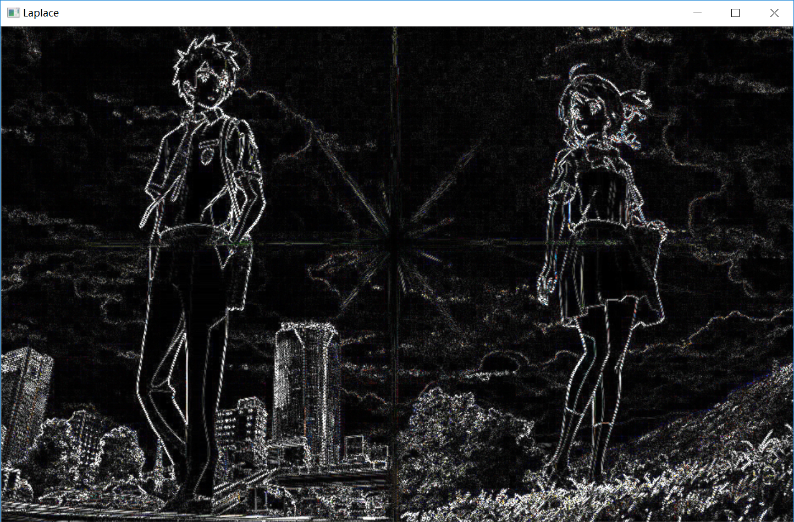

# Simple Image Processing
## Purpose
　　掌握基本的图像处理方法，学会图像的显示、缩放、旋转、直方图等基本操作。学会图像中值滤波和均值滤波，掌握图像锐化、模糊、去噪的基本方法。

## Tools
Python3.6、Opencv

## Steps
1. 功能界面实现  
	使用Python中的Tkinter库中grid、pack组合布局Button、Label、RadioButton等控件，实现一个集合了所需实现功能的操作界面。
2. “打开图片”按钮添加实现功能  
	使用opencv库中的imread、imshow等函数实现。
3. “缩放”按钮功能实现  
	设置两个Label控件来读取输入的高和宽（图片缩放后的尺寸），显示缩放后图片。
4. “旋转”按钮功能实现  
	设置一个Label控件来读取输入的旋转角度（按顺时针旋转），显示旋转后的图片。
5. “锐化”按钮添加功能实现  
	使用RadioButton实现互斥选择（Sobel、Laplace），根据按钮variable参数，使用不同的算子进行图片锐化处理并显示。
6. “线性拉伸”按钮功能实现  
	将原图像转化为灰度图，按照参数a、b调整每个像素的灰度值，进行对比度拉伸，并显示图片。
7. “直方图均衡”按钮功能实现  
	将原图像转化为灰度图，调用Opencv库中的equalizeHist函数对图像进行直方图均衡并显示。
8. “中值滤波”按钮功能实现  
	调用Opencv库中的medianBlur函数对图像进行中值滤波处理并显示。
9. “腐蚀”按钮功能实现  
	调用Opencv库中的erode函数，设置kernel，对图像进行腐蚀处理并显示。
10. “膨胀”按钮功能实现  
	调用Opencv库中的dilate函数，设置kernel，对图像进行膨胀处理并显示。
11. “分割”按钮功能实现  
	设置一个Label控件读取输入的阈值，使用分水岭算法对图像进行分割处理并显示。
12. “色彩空间转换”按钮功能实现  
	使用RadioButton按钮实现互斥选择（XYZ、YCrCb、HSV），根据选择实现相应的色彩控件转换（调用Opencv库中的cvtColor函数）并显示转换后的图像。

## Test
1. 界面实现  

2. 打开图片  

3. 缩放图片  

　　设置图片缩放后的高度为300，宽度为600，将图片的高度和宽度进行更改，显示更改后的图片如图6所示。
4. 旋转图片  

　　旋转图片的时候因窗口大小没有改变，会导致旋转后的图片被切割显示，空白部分默认用黑色填充。所以在旋转图片的时候要根据角度计算新窗口的大小，更改窗口尺寸使完整显示旋转后的图片，设置旋转角度为5°，效果图7所示。
5. 锐化  
Sobel算子锐化:

Laplace算子锐化:

　　Sobel算子使用一阶导数法，Laplace算子使用二阶微分法。从图8和图9中可以看出，Laplace算子相较于Sobel算子能更好地区分背景，锐化人物的边框，但由于Laplace对噪声比Sobel算子敏感，所以Laplace算子锐化存在双边现象。
6. 线性拉伸  

　　对比度是指图片的亮度对比，首先将图片转化为灰度图，对每个像素做处理，将亮的像素调亮，暗的像素调暗，可以提高对比度，得到如上图的效果。
7. 直方图均衡  

　　直方图均衡化是指对图像中像素个数多的灰度级进行展宽，而对图像中像素个数少的灰度进行压缩，提高了对比度和灰度色调的变化，使图像更加清晰。将图片转化为灰度图进行直方图均衡化，可以看到图片确实变得清晰了。
8. 中值滤波  

　　中值滤波是一种非线性平滑技术，将图像中每个像素的值用领域中各点像素的中值替换，消除孤立噪声点。从上图中可以看出，图像中的轮廓变得模糊了，因为轮廓一般是与领域内像素差值较大的像素点。
9. 腐蚀  

　　腐蚀可以实现将图像的边缘腐蚀掉，可以看到图13中心处的光线的粗细明显变细。
10. 膨胀  

　　膨胀是与腐蚀相反的操作，可以实现将图像的边缘扩大，图14中心处的光线的粗细在膨胀操作后明显变粗。
11. 图像分割  

　　将原图像转换为灰度图，使用分水岭算法对图像进行分割，将阈值设置为90，即灰度值大于90的设置为255（白色）、灰度值小于90的设置为0（黑色），如图15所示可以看到剔除了图像中心的光线部分及云等背景。
12. 色彩空间转换  
 RGB转换成XYZ:

RGB转换成YCrCb:
 
RGB转换成HSV:

　　色彩空间转换是调用Opencv库中的cvtColor函数实现，从图16、图17、图18中可以看到RGB与XYZ、YCrCb、HSV色彩空间区别非常明显。XYZ的不均匀性导致不能直观地评价颜色，YCrCb受亮度影响较小，HSV是按色彩、深浅、明暗来描述颜色的。
